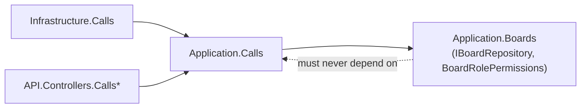
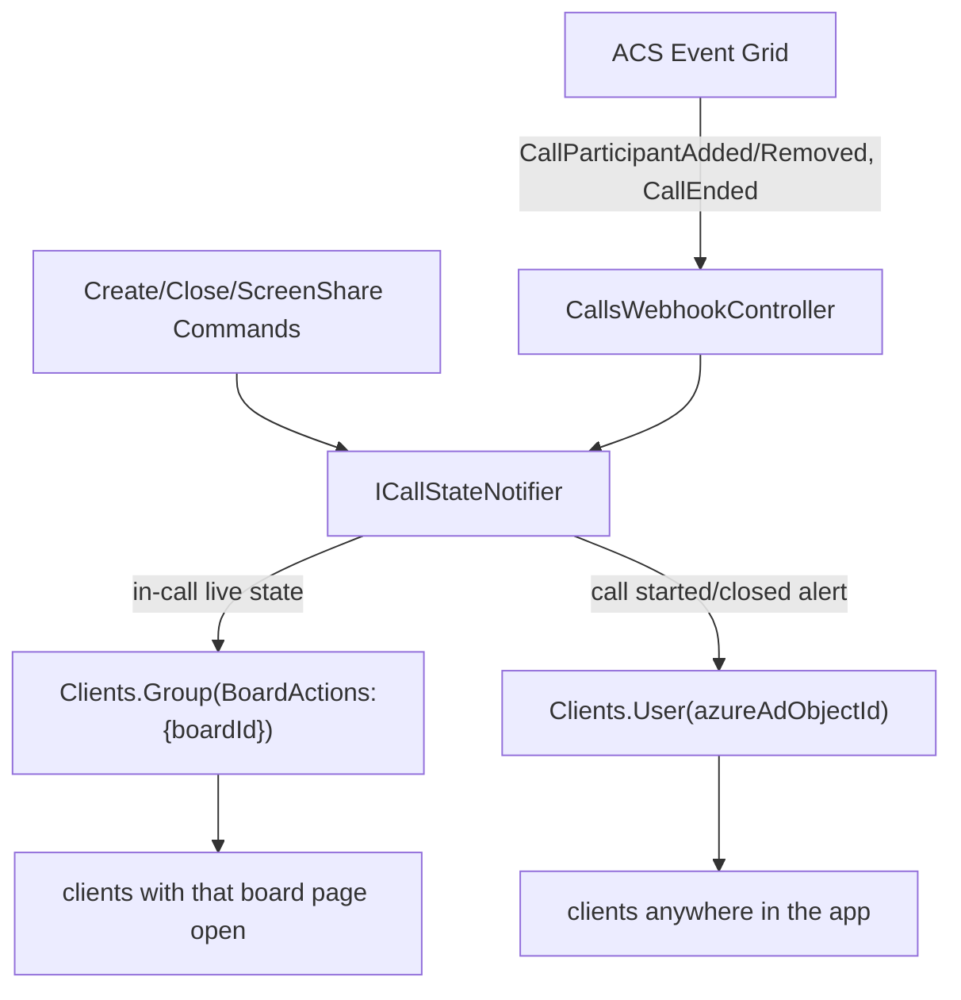
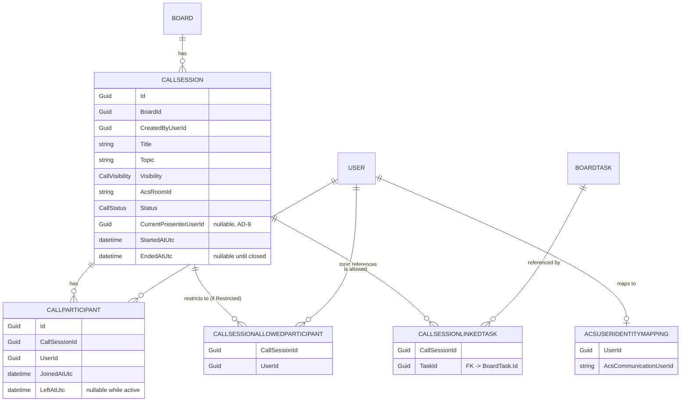

# Architecture Spine — JustTaskTracker Video Calls (ACS)

## Design Paradigm

Inherited, not new: **layered architecture (Domain → Application → Infrastructure/Persistence → API)** with **CQRS via MediatR**, mirrored client-side (WebUI.Domain → WebUI.Services.Abstractions → WebUI.Services → WebUI). The Calls feature is a new vertical slice through the same layers.

| Layer | Server namespace | Client namespace | Holds |
| --- | --- | --- | --- |
| Domain | `JustTaskTracker.Domain.Calls` | `JustTaskTracker.WebUI.Domain.Calls` | Entities, DTOs, errors, constants |
| Application | `JustTaskTracker.Application.Calls` | `WebUI.Services.Abstractions.Calls` | Commands/Queries/Handlers/Validators, repository & notifier interfaces |
| Infrastructure | `JustTaskTracker.Infrastructure.Calls` | `WebUI.Services.Calls` | ACS SDK integration, hub notifier impl, Refit API impl, Store, JS interop service |
| Persistence | `JustTaskTracker.Persistence.Calls` | — | EF Core configs + repository impl |
| API / UI | `API.Controllers.CallsController` / `CallsWebhookController` | `WebUI.Pages.Boards` (call UI embedded in the board page) | Thin HTTP surface / Razor components |

## Invariants & Rules

### AD-1 — ACS is the sole call transport

- **Binds:** all call media, signaling, and screen-share.
- **Prevents:** a second signaling path (self-hosted SignalR/WebRTC mesh or SFU) alongside or instead of ACS.
- **Rule:** all audio/video/screen-share flows exclusively through the Azure Communication Services Calling SDK. `[ADOPTED]`

### AD-2 — SignalR carries call *state*, never call *media*

- **Binds:** the existing SignalR hub layer.
- **Prevents:** SignalR and ACS becoming two competing signaling paths.
- **Rule:** SignalR may only relay call-state notifications sourced from ACS Event Grid events (AD-12) or app-level commands (create/close). It must never carry SDP, ICE candidates, or media. `[ADOPTED]`

### AD-3 — Calls feature mirrors the existing layered/CQRS convention exactly

- **Binds:** all new Calls code, both server and client.
- **Prevents:** a bespoke structure that doesn't match Boards/Billing.
- **Rule:** `Domain/Calls`, `Application/Calls/{Commands,Queries,Repositories,Notifiers,Abstractions}`, `Persistence/Calls/{Configurations,Repositories}`, `Infrastructure/Calls/{AzureCommunication,Notifiers,Auth}`, `API/Controllers/CallsController.cs` + `CallsWebhookController.cs`; one file per command/query holding record + handler + validator, same as `UpdateBoardCommand.cs`. `[ADOPTED, ratifies existing convention]`

### AD-4 — Board-membership authorization for calls reuses the existing mechanism

- **Binds:** every Calls command/query.
- **Prevents:** a second, divergent authorization path.
- **Rule:** commands call `IBoardRepository.GetUserRoleAsync`/`GetBoardWithUserRoleAsync` + `BoardRolePermissions` (extended with a `CanJoinCall`/`CanCreateCall` rule) inside the handler. For a **Restricted** session, board membership is necessary but not sufficient — the handler additionally checks the caller is in that session's `CallSessionAllowedParticipant` list (AD-8), **except** a caller whose `BoardMemberRole` is `Owner` or `Admin` (the existing enum, not new roles), who may join *any* call on their board regardless of the allow-list. `[ADOPTED, ratifies + extends existing convention]`

### AD-5 — Calls → Boards is one-directional

- **Binds:** `Application.Calls`, `Domain.Calls`.
- **Prevents:** a circular dependency between the Calls and Boards feature folders.
- **Rule:** `Application.Calls` may depend on `IBoardRepository`/`BoardRolePermissions`. `Application.Boards` must never reference `*.Calls`. No new anti-corruption-layer interface for this one cross-feature dependency (Rule of Three).



### AD-6 — ACS SDK integration lives in Infrastructure; identity mapping is our own table, not ACS Custom ID

- **Binds:** ACS Identity token issuance, Room lifecycle management, `UserId ↔ ACS communication user id` mapping.
- **Prevents:** ACS SDK calls leaking into Application handlers or Controllers; a dependency on a preview-only ACS feature for a load-bearing mapping.
- **Rule:** `Infrastructure/Calls/AzureCommunication/AcsCallProvisioningService` wraps `Azure.Communication.Identity` + `Azure.Communication.Rooms`, exposed to Application via `IAcsCallProvisioningService`. ACS's **Custom ID** capability (deterministic `UserId`-as-identity mapping) is **not used** — it requires `Azure.Communication.Identity` 1.4.0-beta.1 and the `2025-03-02-preview` REST surface, not the stable 1.3.1 pinned in Stack. Instead, `AcsCallProvisioningService` creates a conventional ACS identity on first use and persists it in `AcsUserIdentityMapping` (`UserId → AcsCommunicationUserId`), looked up on every subsequent token issuance. Tokens are issued with the maximum practical validity (1440 minutes, the ACS ceiling) and re-issued by calling the same endpoint again if a client reconnects after expiry — no refresh-token flow.

### AD-7 — ACS secrets follow the Azure SignalR Service precedent

- **Binds:** ACS connection string / Key Vault reference.
- **Prevents:** treating ACS as an Aspire-hosted resource, or leaking the connection string to the Blazor client.
- **Rule:** API-only configuration per environment, never an Aspire resource — mirrors Azure SignalR Service, since Aspire is local-dev-only in this project. `[ADOPTED per user correction]`

### AD-8 — Multiple concurrent, open-or-restricted CallSessions per Board, one fresh ACS Room per session

- **Binds:** `CallSession` creation, membership, and join authorization.
- **Prevents:** the data model assuming a single active call per board, or a persistent per-board Room that can't hold independent concurrent/future sessions.
- **Rule:**
  - A Board may have any number of concurrent `CallSession`s. Each gets its **own ACS Room**, created at session-creation time (not reused across sessions).
  - `CallSession.Visibility` is `Open` (any board member may join) or `Restricted` (only users in `CallSessionAllowedParticipant`, chosen at creation). The creator is always implicitly allowed on their own `Restricted` session, whether or not they added themselves to the list explicitly.
  - This same shape covers the deferred scheduled-meetings roadmap unchanged: a scheduled session is a `CallSession` with `Status = Scheduled` and a future `ScheduledStartUtc`, same `Visibility`/allow-list fields — no new ACS concept or schema rework needed when that roadmap item is picked up.

### AD-9 — Server-authoritative single-presenter lock, enforced by a conditional write

- **Binds:** screen-share start/stop.
- **Prevents:** two simultaneous screen-share requests racing to a false "both succeeded" outcome, and the presenter slot getting stuck forever on a participant who disconnected without explicitly stopping.
- **Rule:** `RequestScreenShareCommand` sets `CallSession.CurrentPresenterUserId` via a **conditional update** (`WHERE CurrentPresenterUserId IS NULL`, e.g. through EF Core's concurrency-token/`ExecuteUpdate` path) — the write only succeeds if the slot is actually free at that instant, so two concurrent requests can't both win. Checked and written **before** the client invokes the ACS SDK's local start-screen-share. `CurrentPresenterUserId` is also cleared whenever `RecordParticipantLeftCommand` (AD-12) processes a departure for the current presenter — a disconnect or crash releases the lock exactly like an explicit `StopScreenShareCommand` would, closing the gap a graceful-only design would leave. Relayed to viewers via AD-10.

### AD-10 — Two-tier real-time relay: per-board live state vs. cross-page alerts

- **Binds:** all Calls real-time notifications.
- **Prevents:** (a) a redundant third SignalR hub for the same audience Boards already serves; (b) "call started" alerts being missed simply because the recipient is on a different page.
- **Rule:**
  - **In-call live state** (participant joined/left, presenter changed, session closed) — relayed on the existing `BoardActions:{boardId}` group via the new `ICallStateNotifier` (Calls' own notifier, per AD-3 — not a reuse of Boards' `IBoardActionNotifier` interface, though both ultimately call the same `IHubContext<BoardActionsHub>`), since this only matters while that board/call view is open.
  - **Cross-page "call started" alert** — a **custom `IUserIdProvider`** is registered on the existing `BoardActionsHub` connection, keyed on the same `AzureAdObjectId` claim `ICurrentUserAccessor` already reads. The notifier pushes via `IHubContext<BoardActionsHub>.Clients.User(azureAdObjectId).SendAsync(...)` to every eligible recipient (all board members if `Open`, only the allow-list if `Restricted`) — reaching them on **any** app page, not just the board. No new hub or manual group-join needed: the client's `BoardActionsHub` connection is already lifetime-of-the-tab (confirmed via code sweep — `AddScoped` in Blazor WASM's single root DI scope behaves as one persistent connection per open tab; a user with multiple tabs open simply has multiple connections, which `Clients.User(...)` fans out to correctly). `Clients.User(...)` is a no-op for recipients not currently connected, which already satisfies "only notify if online" with no extra bookkeeping.



### AD-11 — Event Grid webhook is anonymous, validated by handshake + signature

- **Binds:** `POST /calls/acs-events`.
- **Prevents:** an unauthenticated endpoint with no validation at all; also rules out AAD-secured delivery as a fallback, since the project's free/Dev-tier Azure subscription doesn't permit adding a Managed Identity as an authorized principal.
- **Rule:** `[AllowAnonymous]` on this action; secured via Event Grid's subscription-validation handshake and delivery signature/validation-key check, per Microsoft's secure-webhook guidance. No AAD app-only delivery. `[ADOPTED]`

### AD-12 — Call lifecycle authority is ACS Event Grid, exclusively; correlated by Room id, tolerant of at-least-once/out-of-order delivery

- **Binds:** `CallParticipant.JoinedAtUtc`/`LeftAtUtc`, `CallSession.Status`/`EndedAtUtc`.
- **Prevents:** two divergent "who's still in the call" sources; a webhook that can't tell which of a board's several concurrent sessions an event belongs to; and state corruption from Event Grid's at-least-once, not-guaranteed-order delivery.
- **Rule:**
  - `Microsoft.Communication.CallParticipantAdded` / `CallParticipantRemoved` / `CallEnded` Event Grid events (confirmed via Microsoft's reference payloads to exist for plain Rooms-based Calling-SDK group calls — payloads carry `room.id` and `isRoomsCall: true`, not just Call Automation) are the **only** source that writes `CallParticipant` join/leave and closes a `CallSession`.
  - **Correlation:** the webhook matches an incoming event to a `CallSession` via `event.data.room.id == CallSession.AcsRoomId` — this is what makes AD-8's multiple-concurrent-Rooms-per-board model resolvable back to the right session.
  - **Idempotency & ordering:** handlers for `RecordParticipantJoinedCommand`/`RecordParticipantLeftCommand` are idempotent (re-applying an already-applied Joined/Left for the same participant is a no-op) and don't assume arrival order — they set `JoinedAtUtc`/`LeftAtUtc` from the event's own timestamp rather than "now," so a delayed or duplicate delivery can't overwrite a later state with an earlier one.
  - The client's "leave" button only calls the ACS SDK's local hang-up — it does not itself call an API command to record the leave (see AD-15 for the one authorized exception, which still routes through this same pipeline). This also makes a crash or dropped connection self-healing: ACS reports the departure to Event Grid regardless of how the client exited.

### AD-13 — Optional task linking reuses existing task-editing UI, doesn't fork one

- **Binds:** `CallSessionLinkedTask`, the call UI's task display.
- **Prevents:** a parallel, Calls-specific task-editing surface that would fork from the existing one.
- **Rule:** `CallSession` optionally links zero or more existing `BoardTask` entities (`CallSessionLinkedTask` join table, `TaskId` FK → `BoardTask.Id`) purely as topic references for MVP. When in-call task editing is picked up later, the call UI embeds the **existing** task-edit component/commands rather than a new editor — this is a UI-composition change then, not a re-architecture now.

### AD-14 — Room-create-then-persist ordering, with orphan compensation

- **Binds:** `CreateCallCommand`.
- **Prevents:** two implementers picking different orderings (persist-first vs. Room-first) and producing either an orphaned ACS Room with no DB row, or a DB row claiming `Active` with no working Room.
- **Rule:** the ACS Room is created **first**; the `CallSession` row (and its `AllowedParticipant`/`LinkedTask` rows) is persisted only after the Room create succeeds, using the returned `AcsRoomId`. If the DB persist step then fails, the handler deletes the just-created ACS Room before returning the error (best-effort compensation) rather than leaving it live and unreferenced. A Room orphaned despite that (e.g. process crash between the two calls) is a cheap, short-lived leak — no participant can ever join it since no `CallSession` row references it — acceptable to clean up later via a periodic reconciliation job, not solved synchronously.

### AD-15 — Force-ending a call is a trigger, not a second writer of call state

- **Binds:** `EndCallCommand`, `CallSession.Status`.
- **Prevents:** an authorized "end call early" action being built as a direct `Status = Closed` write, which would create a second writer alongside AD-12's Event-Grid-exclusive authority.
- **Rule:** the session's `CreatedByUserId`, or a board member whose `BoardMemberRole` is `Owner` or `Admin` (`BoardRolePermissions.CanEndCall`, new — `ScrumMaster`/`User` excluded), may call `EndCallCommand`, which asks ACS to end the Room (e.g. removing all participants / closing the Room via the Rooms API) — it does **not** itself set `CallSession.Status`. ACS then emits `CallParticipantRemoved`/`CallEnded` for the departed participants exactly as it would for a voluntary hang-up, and the existing AD-12 Event-Grid path performs the actual close. `EndCallCommand` is a trigger into the same single authoritative pipeline, not a parallel one.

## Consistency Conventions

| Concern | Convention |
| --- | --- |
| Naming (entities, files) | `CallSession`, `CallParticipant`, `CallSessionAllowedParticipant`, `CallSessionLinkedTask`, `AcsUserIdentityMapping`; command files `CreateCallCommand.cs`, `JoinCallCommand.cs`, `EndCallCommand.cs`, `RequestScreenShareCommand.cs`, `StopScreenShareCommand.cs`, `Internal/RecordParticipantJoinedCommand.cs`, `Internal/RecordParticipantLeftCommand.cs` (record + handler + validator co-located, matching `UpdateBoardCommand.cs`) |
| Naming (JS interop) | `wwwroot/js/calls.js` + `CallsInteropService`, matching `boardPanScroll.js` + `BoardPanScrollService` |
| Data & formats (ids, dates) | `Guid` ids throughout; UTC timestamps named `*AtUtc` (`StartedAtUtc`, `EndedAtUtc`, `JoinedAtUtc`, `LeftAtUtc`), matching `BoardMember.JoinedAtUtc` |
| Field constraints | `CallSession.Title` required, max 50 chars; `CallSession.Topic` optional, max 200 chars — validated via FluentValidation on `CreateCallCommand`, lengths declared as `CallFieldLengths` constants matching the existing `BoardFieldLengths` convention |
| State & cross-cutting | Handlers return `Result`/`Result<T>`; persistence commits via `IUnitOfWork.SaveChangesAsync(ct)` in the handler; current user via `ICurrentUserAccessor.AzureAdObjectId` |
| Real-time push | Only through `ICallStateNotifier` (Application) + implementation (Infrastructure) calling `IHubContext<BoardActionsHub>` — either `.Clients.Group(HubGroupNames.BoardActions.Get(boardId))` (live state) or `.Clients.User(azureAdObjectId)` (cross-page alert), per AD-10. Never a hub method pushing directly. |
| Webhook idempotency | Event Grid handlers key on `(AcsRoomId, ParticipantAcsUserId, EventType)` to detect and skip re-delivery; state timestamps come from the event payload, never `DateTime.UtcNow` at handling time (AD-12) |
| Client join UX | Before enabling "join"/"create call," check the Calling SDK's `isSupportedBrowser`/`getEnvironmentInfo()` and surface a clear message on unsupported browsers rather than a silent failure; run pre-call diagnostics (mic/camera/network) on join |

## Stack

| Name | Version |
| --- | --- |
| @azure/communication-calling (JS Calling SDK, via Blazor JS interop) | 1.43.1 |
| Azure.Communication.Identity (.NET, server-side token issuance) | 1.3.1 |
| Azure.Communication.Rooms (.NET, server-side Room management) | 1.2.0 |
| Azure.Messaging.EventGrid (.NET, webhook event deserialization) | 5.0.0 |
| .NET / EF Core / MediatR / Blazor WASM | inherited — existing solution versions apply, not re-pinned here |

## Structural Seed

```text
src/api/
  JustTaskTracker.Domain/Calls/
    Entities/CallSession.cs
    Entities/CallParticipant.cs
    Entities/CallSessionAllowedParticipant.cs   # only populated when Visibility = Restricted
    Entities/CallSessionLinkedTask.cs           # optional topic links, AD-13
    Enums/CallStatus.cs                         # Active | Closed | (Scheduled, deferred)
    Enums/CallVisibility.cs                     # Open | Restricted
    Errors/CallErrors.cs
  JustTaskTracker.Application/Calls/
    Commands/CreateCallCommand.cs               # Title, Topic, Visibility, AllowedUserIds?, LinkedTaskIds? -- AD-14 ordering
    Commands/JoinCallCommand.cs
    Commands/EndCallCommand.cs                  # AD-15, creator/admin-triggered, not a state writer
    Commands/RequestScreenShareCommand.cs        # AD-9, conditional write
    Commands/StopScreenShareCommand.cs           # AD-9
    Commands/Internal/RecordParticipantJoinedCommand.cs   # invoked only from the Event Grid webhook, AD-12
    Commands/Internal/RecordParticipantLeftCommand.cs     # invoked only from the Event Grid webhook, AD-12; clears CurrentPresenterUserId if departing user was presenter
    Queries/ListActiveCallSessionsForBoardQuery.cs
    Queries/GetCallSessionHistoryForBoardQuery.cs
    Repositories/ICallRepository.cs
    Repositories/IAcsUserIdentityMappingRepository.cs   # AD-6
    Notifiers/ICallStateNotifier.cs
    Abstractions/IAcsCallProvisioningService.cs
  JustTaskTracker.Persistence/Calls/
    Configurations/CallSessionConfiguration.cs
    Configurations/CallParticipantConfiguration.cs
    Configurations/CallSessionAllowedParticipantConfiguration.cs
    Configurations/CallSessionLinkedTaskConfiguration.cs
    Configurations/AcsUserIdentityMappingConfiguration.cs   # AD-6
    Repositories/CallRepository.cs
  JustTaskTracker.Infrastructure/Calls/
    AzureCommunication/AcsCallProvisioningService.cs   # AD-6
    Notifiers/CallStateNotifier.cs                     # implements ICallStateNotifier, AD-10
    Auth/AzureAdObjectIdUserIdProvider.cs              # IUserIdProvider, AD-10
  JustTaskTracker.API/Controllers/
    CallsController.cs                          # create/join/screen-share actions
    CallsWebhookController.cs                   # POST /calls/acs-events, [AllowAnonymous], AD-11/AD-12

src/client/
  JustTaskTracker.WebUI.Domain/Calls/           # DTOs, notification payload types
  JustTaskTracker.WebUI.Services.Abstractions/Calls/
    ICallsApiService.cs
    ICallsHubNotifications.cs                   # typed handlers for both group + user-targeted events
  JustTaskTracker.WebUI.Services/Calls/
    Api/ICallsApi.cs                            # Refit
    CallsApiService.cs
    Stores/CallSessionStore.cs
    Stores/ActiveCallAlertStore.cs               # cross-page "someone started a call" state, AD-10
  JustTaskTracker.WebUI/
    wwwroot/js/calls.js                         # ACS Calling Web SDK wrapper
    Services/CallsInteropService.cs
    Pages/Boards/BoardPage.razor                 # call list + call UI embedded here
    Layout/MainLayout.razor                      # subscribes to the user-targeted alert, app-wide
```

### Core entities



### Create-and-join sequence

```mermaid
sequenceDiagram
    participant Client as Blazor Client (creator)
    participant API as CallsController
    participant ACS as ACS (Identity + Rooms)
    participant Other as Other board members

    Client->>API: POST /calls (boardId, title, topic, visibility, allowedUserIds?, linkedTaskIds?)
    API->>API: check board membership (AD-4)
    API->>ACS: create Room (AD-8)
    ACS-->>API: AcsRoomId
    API->>API: persist CallSession with AcsRoomId (+ AllowedParticipant/LinkedTask rows) -- AD-14 ordering
    API-->>Client: session details (no token yet -- Create only provisions)
    API-->>Other: Clients.User(azureAdObjectId) "call started" alert (AD-10; all board members if Open, allow-list only if Restricted)
    Client->>API: POST /calls/{id}/join (any authorized member, including the creator)
    API->>API: check board membership + Status == Active
    API->>ACS: add room participant (via AcsUserIdentityMapping lookup/create, AD-6) + issue token
    ACS-->>API: token
    API-->>Client: AcsRoomId, token
    Client->>ACS: join Room (JS interop, calls.js)
```

### Participant lifecycle (server-authoritative)

```mermaid
sequenceDiagram
    participant ACS as ACS
    participant EG as Event Grid
    participant Webhook as CallsWebhookController
    participant DB as CallParticipant / CallSession
    participant Hub as BoardActionsHub

    ACS-->>EG: CallParticipantAdded / CallParticipantRemoved / CallEnded (payload includes room.id)
    EG->>Webhook: POST /calls/acs-events (validated per AD-11)
    Webhook->>DB: match CallSession by AcsRoomId == event.room.id (AD-12); idempotent, timestamp from event
    Webhook->>DB: record Joined/LeftAtUtc; clear CurrentPresenterUserId if departing user was presenter; if no active participants remain, Status=Closed, EndedAtUtc=now
    Webhook->>Hub: notify BoardActions:{boardId} group (in-call live state, AD-10)
```

## Capability → Architecture Map

| Capability / Area | Lives in | Governed by |
| --- | --- | --- |
| Create call (open or restricted, optional topic/tasks) | `Application.Calls.Commands.CreateCallCommand`, `Infrastructure.Calls.AzureCommunication` | AD-1, AD-3, AD-4, AD-6, AD-8, AD-13, AD-14 |
| Join call | `Application.Calls.Commands.JoinCallCommand` | AD-4, AD-8 |
| Force-end call early | `Application.Calls.Commands.EndCallCommand` | AD-15 |
| Single-presenter screen share | `Application.Calls.Commands.{Request,Stop}ScreenShareCommand` | AD-9 |
| Participant join/leave + session closure | `CallsWebhookController` + `Commands.Internal.Record*` | AD-12 |
| In-call live state relay | `BoardActionsHub` / `ICallStateNotifier` (group-targeted) | AD-2, AD-10 |
| Cross-page "call started" alert | `BoardActionsHub` + `AzureAdObjectIdUserIdProvider` (user-targeted) | AD-10 |
| ACS event ingestion | `API.Controllers.CallsWebhookController` | AD-11, AD-12 |
| Board membership / allow-list gate | `IBoardRepository` + `BoardRolePermissions` (existing) + `CallSessionAllowedParticipant` | AD-4, AD-5, AD-8 |
| Call-history view on board | `Queries.GetCallSessionHistoryForBoardQuery` | AD-8 |
| User ↔ ACS identity mapping | `Infrastructure.Calls.AzureCommunication.AcsCallProvisioningService` + `AcsUserIdentityMapping` | AD-6 |

## Deferred

- **Scheduled meetings (date/time) + calendar view** — out of scope now. AD-8's shape (`Visibility`/allow-list on `CallSession`) already covers it: a scheduled session is the same entity with `Status = Scheduled` and a future `ScheduledStartUtc`/`ScheduledEndUtc` (not yet added as columns), no new ACS concept. No calendar read-model designed yet.
- **In-call task editing** (assign, edit description) — deferred per AD-13; UI-composition addition later, not a re-architecture.
- **Call recording** — not requested; not modeled. New AD (storage, consent, retention) if picked up.
- **Multi-presenter / breakout rooms** — out of scope; AD-9 assumes exactly one active presenter per session.
- **Cross-provider calling abstraction** — not warranted (Rule of Three): no `ICallProvider` abstraction above the ACS-specific service.
- **ACS Room region/geography selection** — deferred to deployment/ops setup; no data-residency requirement stated for this project.
- **Notification durability** — `Clients.User(...)` alerts are live-only (missed if the recipient's client isn't connected at send time); no persisted notification-center/inbox entry is modeled. Acceptable for MVP since board-page load already shows active/historical calls via `ListActiveCallSessionsForBoardQuery`/`GetCallSessionHistoryForBoardQuery`.
- **No cap on concurrent CallSessions per board** — AD-8 allows any number; no rate limit is set. Revisit if abuse or ACS cost becomes a real concern.
- **ACS Room/resource provisioning as infrastructure-as-code** — the ACS resource itself (and its region/geography) is assumed to already exist or be provisioned manually; no Bicep/Terraform ownership is defined here.
- **Cost monitoring** — ACS bills per participant-minute ($0.004, uniform across audio/video/screen-share, no egress charge, per the research doc); no cost-tracking/alerting is wired up here. Tag the ACS resource and review spend via Azure Cost Management once the feature is live.
- **Local/automated testing against ACS** — there's no ACS emulator; development and manual testing happen against a real, low-cost dev-tier ACS resource (per the research doc). No automated test strategy for the Calls feature is defined in this spine.
